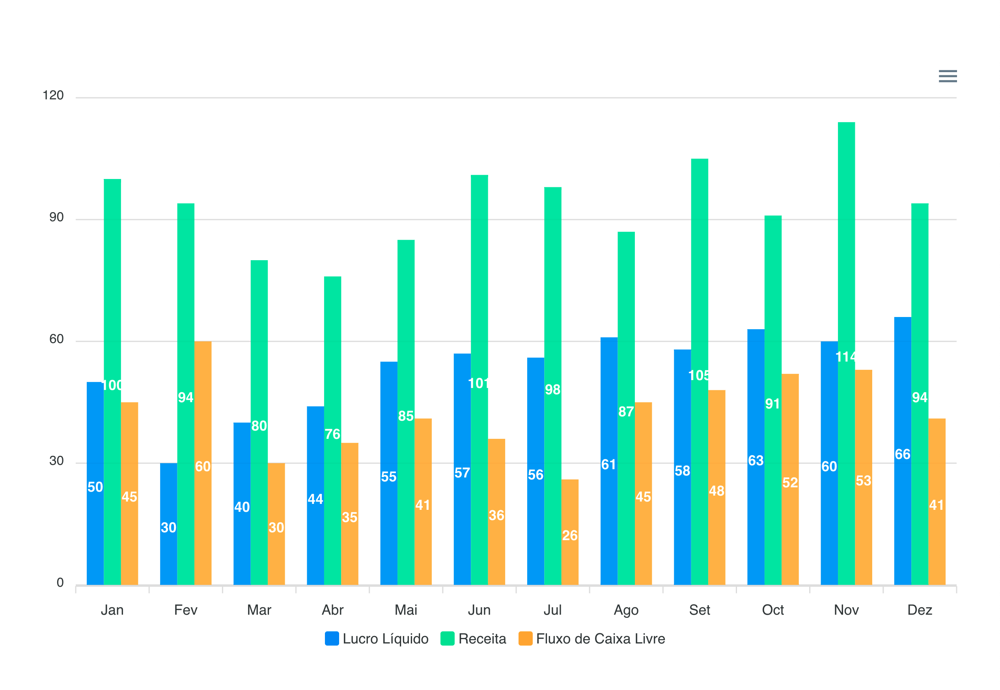

# Tutorial apexcharts em Vue

## O que é Apexcharts?

ApexCharts é uma biblioteca de gráficos que ajuda a criar visualizações interactivas para páginas web. 

Para utilizar o ApexCharts em uma aplicação Vue podemos usar a biblioteca chamada vue-apexcharts, que ser como um involucro especifico para a biblitoeca apexcharts se conectar com uma aplicação vue.

## Começando

Primeiro, precisamos de instalar o Vue CLI com o comando abaixo, para que seja possivel criar uma aplicação Vue de forma fácil.

Nota: Para utilizar o CLI, é necessário ter instalado o Node.js versão 8 ou superior (8.10.0+ é recomendado).

Para instalar o CLI, execute este comando no seu terminal:

```
npm install -g @vue/cli
```

Depois de instalado poderemos criar o projeto, você pode instalar utilizando o seguinte comando:

```
vue create apexcharts-tutorial
```

Nota: para o tutorial estarei utilizando a versão 2 do Vue. Este tutorial não serve para a versão 3

## Instalando Apexcharts

Agora precisamos instalar a biblioteca apexcharts para que seja possivel utizá-la em nossa aplicação.
Para instalar a biblioteca vue-apexcharts na nossa aplicação, utilize estes comandos:

```
npm install --save apexcharts 
npm install --save vue-apexcharts
```

## Configurando o apexcharts

Agora que temos instalados o vue-apexcharts, precisamos importá-lo na nossa aplicação. 

Abra o diretório `src` e crie um novo diretório chamado `plugins`. Dentro do novo diretorio de `plugins`, crie um arquivo chamado `apexcharts.js`.

Em seguida, vamos criar um componente Vue para o apexcharts no arquivo `apexcharts.js`. Isto tornará o componente globalmente disponível na nossa aplicação.

Para o fazer, importaremos tanto o `vue` e o `vue-apexcharts`. Em seguida, criaremos um componente global chamada apex-chart. Seu aquivo `apexcharts.js`deve ficar da seguinte maneira:

```
import Vue from 'vue'
import VueApexCharts from 'vue-apexcharts'

Vue.component('apex-chart', VueApexCharts)
```


## Importando o plugin criado

Temos que importar o arquivo que acabamos de criar para que o Vue possa utilizá-lo. Abra o ficheiro `main.js` e adicione a seguinte linha após a última declaração de importação:

```
import '@/plugins/apexcharts'
```

## Criando nosso primeiro gráfico

Iremos criar o primeiro gráfico no componente principal App. Este componente foi criado automaticamente quando utilizámos o Vue CLI para criar a nossa aplicação.

Abra o arquivo `App.vue` e apague aí todo o código de demonstração.

O seu arquivo deve ficar parecido com isso:

````
<template>
</template>
<script>
export default {
 name: 'HelloWorld'
}
</script>
<style scoped>
</style>
````

Agora iremos chamar nosso plugin no componente principal.

O `vue-apexcharts` constroe gráficos utilizando os dados que se passam para eles usando `props`(propriedades), como se vê no código abaixo. Utilizaremos isso para criar o HTML para o nosso gráfico. Começaremos com um gráfico de barras básico.

````
<template>
  <div>
   <apex-chart 
     width="500" type="bar" 
     :options="options" :series="series">
   </apex-chart>  
  </div>
</template>
````

Como se pode ver no modelo acima, o componente do apexchart contém 4 `props`. Agora vamos definir as propriedades que serão iniciadas em `options`.

````
<script>
export default {
  name: 'HelloWorld',
  data: () => ({
    options: {
      chart: {
        id: 'vuechart-example'
      },
      xaxis: {
        categories: [
         "Jan",
         "Fev",  
         "Mar",
         "Abr",
         "Mai",
         "Jun",
         "Jul",
         "Ago",
         "Set",
         "Oct",
         "Nov",
         "Dez"
        ]
      },
    },
    series: [{
        name: 'Lucro Líquido',
        data: [50,30,40,44, 55, 57, 56, 61, 58, 63, 60, 66],
    },{
        name: 'Receita',
        data: [100,94,80,76, 85, 101, 98, 87, 105, 91, 114, 94],
    },{
        name: 'Fluxo de Caixa Livre',
        data: [45,60,30,35, 41, 36, 26, 45, 48, 52, 53, 41],
    }]
  })
}
</script>
````
Estamos passando para as propriedades do gráfico os pontos do eixo x que são os meses e 3 séries que serão descritas no gráfico através desses meses, as 3 séries são: Lucro Líquido, Receita e Fluxo de Caixa Livre. 

## Rodando o sistema

Para vermos o resultado do nosso primeio gráfico e rodar o sistema precisamos rodar o seguinte comando.

````
npm run serve
````

Após aparecer como output algo como o resultado abaixo poderemos visualizar o resultado através da url `http://localhost:8080/`.

````
 DONE  Compiled successfully in 85ms                                                                                                
  
App running at:
  - Local:   http://localhost:8080/ 
  - Network: http://192.x.x.x:8080/
````

Em um primeiro momento iremos ver algo como:




## Mudando o estilo do gráfico

No nosso exemplo iniciamos criando um gráfico de barras, porem podemos criar diferentes tipos de gráfico com o `apex-charts`. 

Para obtermos um gráfico de area basta trocarmos a propriedade `type` de `bar` para `area`, assim:

````
<apex-chart 
    width="800" type="area" 
    :options="options" :series="series">
</apex-chart>
````

Algumas opções de gráfico são ` ["bar", "area", "scatter", "line", "radar"]`. Embaixo segue imagens dessas opções, tirando `bar`que já foi mostrado..


## Mudando de cor da série do gráfico

Existem duas formas de mudar a cor da séries, você pode explicitamente dizer qual cor você quer que cada série possua ou você pode passar uma lista de cores que serão usadas na ordem que forem passadas.

```
data: () => ({
    ...,
    options: {
        ...,
        colors: ['#003f5c', '#bc5090', '#ffa600'],
        ...
    },
    series: [{
                name: 'Lucro Líquido',
                data: [50,30,40,44, 55, 57, 56, 61, 58, 63, 60, 66],
                color: '#003f5c'
            }, {
                name: 'Receita',
                data: [100,94,80,76, 85, 101, 98, 87, 105, 91, 114, 94],
                color: '#bc5090'
            }, {
                name: 'Fluxo de Caixa Livre',
                data: [45,60,30,35, 41, 36, 26, 45, 48, 52, 53, 41],
                color: '#ffa600'
    }],
    ...
})
```

Dessa forma, nossos gráficos irão ter esse aspecto:


## Edição de eixos

Gráficos com eixos x e y permitem que façamos edições em seus eixos, uma edição possivel é reverter o referencial para que fique de cima para baixo, isso pode ser feito da seguinte forma:

````
options: {
    ...,
    yaxis: {
        reversed: true,
    }
}
````

Dessa forma, obtermos o gráfico da seguinte forma:


## Edição de eixos

Gráficos com eixos x e y permitem que façamos edições em seus eixos, uma edição possivel é reverter o referencial para que fique de cima para baixo, isso pode ser feito da seguinte forma:

````
options: {
    ...,
    yaxis: {
        reversed: true,
    }
}
````

Dessa forma, obtermos o gráfico da seguinte forma:


## Título do Gráfico

É possivel adicionarmos título ao gráfico utilizando a option `title`, nela é possivel definir diferentes caracteristicas de estilo ao título, abaixo podemos ver um exemplo de como adicionar título.

````
options: {
    ...,
      title: {
        text: 'Indicadores financeiros',
        align: 'center',
        style: {
            fontSize:  '20px',
            fontWeight:  'bold',
            fontFamily:  undefined,
            color:  '#263238'
        },
}
````

Dessa forma, obtermos o gráfico da seguinte forma:


# Playground Apexcharts 

A ideia é que esse projeto possa ser usado como um playground da biblioteca `Apexcharts` para poder ver algumas modificações dos gráficos sendo feitas em tempo real.

Para isso é necessário baixar o proejeto e rodar os seguintes comandos:

````
npm install
npm run serve
````
